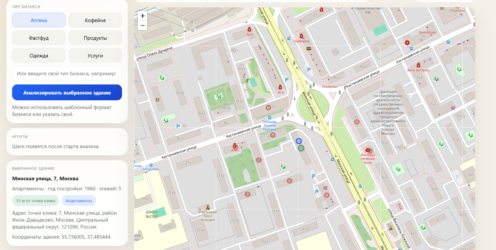
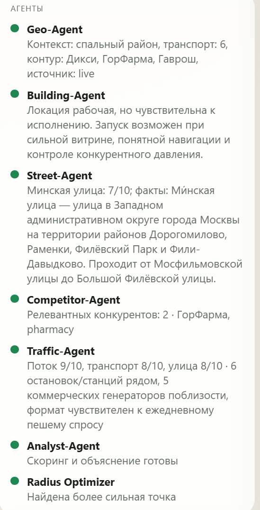
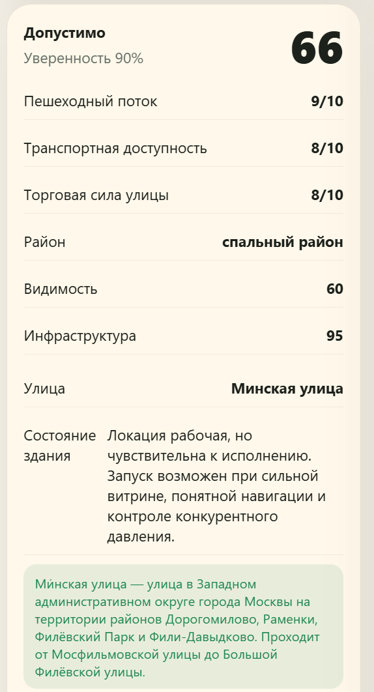
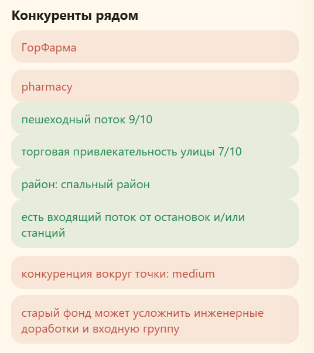
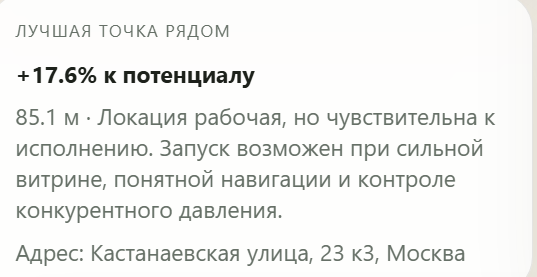

# GeoVerdict.AI

> Pet-проект: AI-система для выбора места под офлайн-точку в городах-миллионниках РФ  
> FastAPI · Leaflet/OpenStreetMap · Multi-Agent Pipeline · Ollama/OpenAI-compatible runtime · Prometheus + Grafana

---

## О проекте

GeoVerdict.AI — pet-проект на стыке геоаналитики, agentic workflow и LLMOps. Идея проекта — собрать в одном интерфейсе понятную оценку городской локации под офлайн-бизнес: не просто показать карту и сырые данные, а помочь ответить на практический вопрос — стоит открываться здесь или лучше искать соседнюю точку.

---

## Что умеет проект

- Показывает карту 16 городов-миллионников России
- Даёт выбрать не просто координату, а конкретное здание рядом с точкой клика
- Анализирует адрес, районный тип, улицу, пешеходный поток, транспорт и конкурентов
- Строит понятный вердикт: `Рекомендуем`, `Допустимо`, `Не рекомендуем`
- Сканирует соседние точки и, если рядом есть лучшее микрорасположение, показывает его на карте и объясняет почему
- Сохраняет историю анализов по пользователю
- Даёт отдельную LLMOps-панель с runtime-конфигом, traces, затратами, качеством, графиками и feedback

---

## Какую задачу решает

GeoVerdict.AI помогает малому и среднему офлайн-бизнесу быстро ответить на вопрос:

`Открываться здесь или искать точку лучше?`

Сейчас для этого обычно приходится вручную собирать адрес, смотреть карту, оценивать поток, конкурентов, транспорт и затем всё равно принимать решение почти на интуиции. Профессиональные геоаналитические платформы есть, но они слишком тяжёлые и дорогие для большинства SMB-команд.

---

## Для кого проект

- владельцы малого и среднего ритейла;
- франчайзи;
- менеджеры по развитию сетей;
- предприниматели, валидирующие офлайн-гипотезу;
- консалтинговые агентства, работающие с локациями.

---

## Основной сценарий использования

1. Зарегистрироваться и войти.
2. Открыть `http://localhost:8000/app`.
3. Выбрать город, кликнуть по карте и выбрать здание из списка.
4. Указать тип бизнеса или ввести свой.
5. Запустить анализ.
6. Проверить:
   - итоговую оценку;
   - районный тип;
   - оценки `пешеходный поток / транспорт / улица` по шкале `1..10`;
   - рекомендации по лучшей точке рядом;
   - сохранение анализа в истории.
7. Открыть `http://localhost:8000/ops-ui` и проверить:
   - статусы провайдеров;
   - конфигурацию runtime по агентам;
   - трейсы и скачивание log;
   - графики нагрузки и latency;
   - feedback из GeoVerdict.

---

## Текущие ограничения

- прогноз выручки, ROI и окупаемости;
- работа с малыми городами вне целевого фокуса;
- бронирование помещений и работа с арендодателями;
- indoor-аналитика внутри ТЦ;
- юридическая экспертиза по ограничениям использования объекта.

---

## Быстрый запуск

### 1. Локально через WSL

```bash
cp .env.example .env
make local-up
```

### 2. Что открыть

- GeoVerdict: `http://localhost:8000/app`
- LLMOps: `http://localhost:8000/ops-ui`
- Swagger: `http://localhost:8000/docs`
- Prometheus: `http://localhost:8000/prometheus`
- Grafana: `http://localhost:8000/grafana`
  Логин по умолчанию: `admin / admin`

### 3. Остановка

```bash
make local-down
```

---

## Как быстро попробовать

### Smoke test

```bash
curl http://127.0.0.1:8000/api/v1/health
curl http://127.0.0.1:8000/prometheus
curl http://127.0.0.1:8000/grafana
```

### Что должно работать

| Что | Где смотреть | Ожидаемый результат |
|---|---|---|
| GeoVerdict UI | `http://localhost:8000/app` | Карта, выбор здания, анализ, история |
| LLMOps UI | `http://localhost:8000/ops-ui` | Метрики, runtime, traces, feedback |
| Prometheus | `http://localhost:8000/prometheus` | либо живой Prometheus, либо диагностическая страница |
| Grafana | `http://localhost:8000/grafana` | либо живой Grafana, либо диагностическая страница |
| Trace log | из вкладки `Трейсы` | JSON со step traces, score, llm metrics |

---

## Структура проекта

```text
backend/
  app/
    agents/              # Оркестратор и шаги мультиагентного анализа
    api/                 # FastAPI endpoints
    geo/                 # Reverse geocode, buildings, street/building insight
    llm/                 # Router провайдеров, fallback, runtime config
    metrics/             # Prometheus-метрики
    models/              # Pydantic + ORM
    services/            # Репозиторий, persistence
    static/              # backend-hosted GeoVerdict и LLMOps UI
docs/
  diagrams/             # C4, workflow, data flow
  specs/                # Спецификации по модулям
monitoring/
  prometheus/           # scrape config
  grafana/              # datasource + dashboard provisioning
frontend/               # отдельный Next frontend (не основной demo entrypoint)
llmops-dashboard/       # отдельный Vite dashboard (не основной demo entrypoint)
scripts/                # WSL start/stop
```

---

## Документация

- [System Design](docs/system-design.md)
- [Governance](docs/governance.md)
- [C4 Context](docs/diagrams/c4-context.md)
- [C4 Container](docs/diagrams/c4-container.md)
- [C4 Component](docs/diagrams/c4-component.md)
- [Workflow](docs/diagrams/workflow.md)
- [Data Flow](docs/diagrams/data-flow.md)
- [Retriever Spec](docs/specs/retriever.md)
- [Tools / APIs Spec](docs/specs/tools-apis.md)
- [Memory / Context Spec](docs/specs/memory-context.md)
- [Agent / Orchestrator Spec](docs/specs/agent-orchestrator.md)
- [Serving / Config Spec](docs/specs/serving-config.md)
- [Observability / Evals Spec](docs/specs/observability-evals.md)

---

## Скриншоты

Для README подготовлены следующие скриншоты интерфейса:

- главный экран с картой и выбором здания;
- панель агентов и ход анализа;
- итоговая карточка вердикта;
- блок конкурентов и сильных/слабых сигналов;
- карточка «Лучшая точка рядом».

Рекомендуемые имена файлов в `README-assets/`:

```text
README-assets/
  geoverdict-map.png
  geoverdict-agents.png
  geoverdict-verdict.png
  geoverdict-competitors.png
  geoverdict-best-point.png
```

После добавления файлов в репозиторий этот блок можно оставить в таком виде:

```md









```

