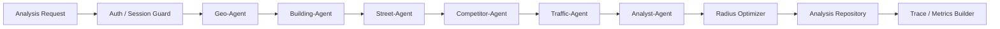

# C4 Component

```mermaid
flowchart LR
    Input["Analysis Request"]
    Auth["Auth / Session Guard"]
    GeoAgent["Geo-Agent"]
    BuildingAgent["Building-Agent"]
    StreetAgent["Street-Agent"]
    CompetitorAgent["Competitor-Agent"]
    TrafficAgent["Traffic-Agent"]
    Analyst["Analyst-Agent"]
    Optimizer["Radius Optimizer"]
    Repo["Analysis Repository"]
    Trace["Trace / Metrics Builder"]

    Input --> Auth
    Auth --> GeoAgent
    GeoAgent --> BuildingAgent
    BuildingAgent --> StreetAgent
    StreetAgent --> CompetitorAgent
    CompetitorAgent --> TrafficAgent
    TrafficAgent --> Analyst
    Analyst --> Optimizer
    Optimizer --> Repo
    Repo --> Trace
```
