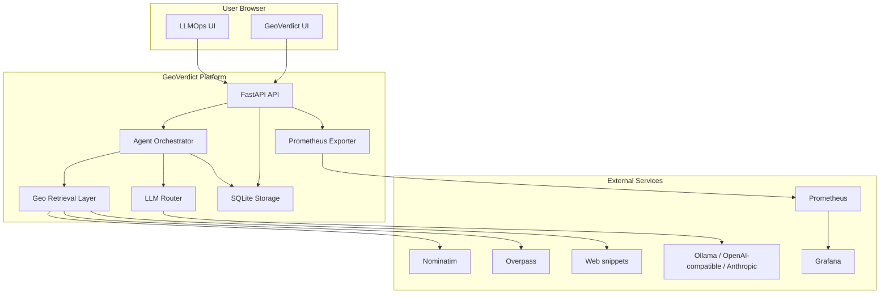

# C4 Container

```mermaid
flowchart TB
    subgraph Browser["User Browser"]
        APP["GeoVerdict UI"]
        OPS["LLMOps UI"]
    end

    subgraph Platform["GeoVerdict Platform"]
        API["FastAPI API"]
        ORCH["Agent Orchestrator"]
        GEO["Geo Retrieval Layer"]
        ROUTER["LLM Router"]
        STORE["SQLite Storage"]
        METRICS["Prometheus Exporter"]
    end

    subgraph External["External Services"]
        NOM["Nominatim"]
        OSM["Overpass"]
        SEARCH["Web snippets"]
        MODEL["Ollama / OpenAI-compatible / Anthropic"]
        PROM["Prometheus"]
        GRAF["Grafana"]
    end

    APP --> API
    OPS --> API
    API --> ORCH
    API --> STORE
    API --> METRICS
    ORCH --> GEO
    ORCH --> ROUTER
    ORCH --> STORE
    GEO --> NOM
    GEO --> OSM
    GEO --> SEARCH
    ROUTER --> MODEL
    METRICS --> PROM
    PROM --> GRAF
```
