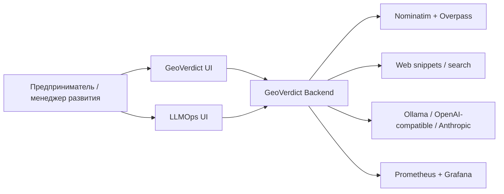

# C4 Context

```mermaid
flowchart LR
    User["Предприниматель / менеджер развития"]
    GeoVerdict["GeoVerdict UI"]
    Ops["LLMOps UI"]
    Backend["GeoVerdict Backend"]
    Geo["Nominatim + Overpass"]
    Web["Web snippets / search"]
    LLM["Ollama / OpenAI-compatible / Anthropic"]
    Obs["Prometheus + Grafana"]

    User --> GeoVerdict
    User --> Ops
    GeoVerdict --> Backend
    Ops --> Backend
    Backend --> Geo
    Backend --> Web
    Backend --> LLM
    Backend --> Obs
```
