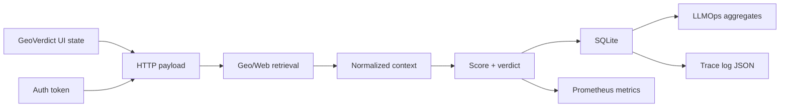

# Data Flow

```mermaid
flowchart LR
    UI["GeoVerdict UI state"]
    AUTH["Auth token"]
    API["HTTP payload"]
    RETR["Geo/Web retrieval"]
    CTX["Normalized context"]
    SCORE["Score + verdict"]
    DB["SQLite"]
    OPS["LLMOps aggregates"]
    TRACE["Trace log JSON"]
    PROM["Prometheus metrics"]

    UI --> API
    AUTH --> API
    API --> RETR
    RETR --> CTX
    CTX --> SCORE
    SCORE --> DB
    DB --> OPS
    DB --> TRACE
    SCORE --> PROM
```
