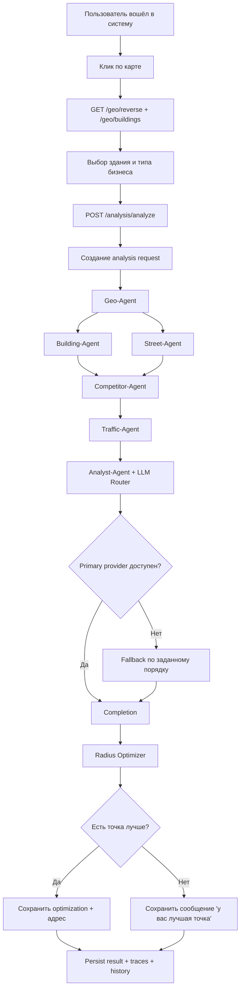

# Workflow

```mermaid
flowchart TD
    A["Пользователь вошёл в систему"] --> B["Клик по карте"]
    B --> C["GET /geo/reverse + /geo/buildings"]
    C --> D["Выбор здания и типа бизнеса"]
    D --> E["POST /analysis/analyze"]
    E --> F["Создание analysis request"]
    F --> G["Geo-Agent"]
    G --> H["Building-Agent"]
    G --> I["Street-Agent"]
    H --> J["Competitor-Agent"]
    I --> J
    J --> K["Traffic-Agent"]
    K --> L["Analyst-Agent + LLM Router"]
    L --> M{"Primary provider доступен?"}
    M -- "Нет" --> N["Fallback по заданному порядку"]
    M -- "Да" --> O["Completion"]
    N --> O
    O --> P["Radius Optimizer"]
    P --> Q{"Есть точка лучше?"}
    Q -- "Да" --> R["Сохранить optimization + адрес"]
    Q -- "Нет" --> S["Сохранить сообщение 'у вас лучшая точка'"]
    R --> T["Persist result + traces + history"]
    S --> T
```
