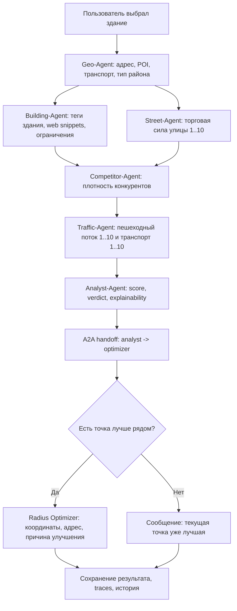

# System Design — GeoVerdict.AI

## 1. Ключевые архитектурные решения

- Основной PoC работает как `backend-hosted UI + FastAPI API`, чтобы демонстрация не зависела от отдельного Node runtime.
- Итоговый вердикт собирается из детерминированных гео- и бизнес-эвристик, а LLM используется для explainability и управляемого fallback.
- Runtime моделей задаётся отдельно для каждого агента: `primary provider + ordered fallback chain + model override`.
- Наблюдаемость разведена на два слоя:
  - продуктовый/агентный через `LLMOps UI` и trace logs;
  - технический через `Prometheus + Grafana`.
- Базовое хранение PoC — `SQLite`, но контракты совместимы с миграцией на PostgreSQL.

## 2. Модули и роли

- `GeoVerdict UI`
  Пользовательская карта, выбор здания, запуск анализа, история и feedback.
- `LLMOps UI`
  Runtime-конфиг, traces, costs, quality, charts, feedback inbox.
- `FastAPI API`
  Контракты для auth, geo, analysis, history, feedback, ops.
- `Agent Orchestrator (LangGraph)`
  Управляет шагами пайплайна через граф нод, step status, A2A-style handoff и stop condition.
- `Geo Retrieval Layer`
  Работает с `Nominatim`, `Overpass`, web snippets и fallback-эвристиками.
- `LLM Router`
  Хранит runtime config, выбирает провайдера для каждого агента и применяет fallback.
- `Storage Layer`
  Хранит пользователей, сессии, login attempts, анализы, feedback.
- `Observability Layer`
  Экспортирует Prometheus metrics и готовит данные для dashboard/traces.

## 3. Основной workflow

1. Пользователь логинится.
2. Выбирает город и кликает по карте.
3. `Geo API` возвращает адрес точки и список ближайших зданий.
4. Пользователь выбирает здание и тип бизнеса.
5. `POST /analysis/analyze` создаёт request и запускает background pipeline.
6. Оркестратор выполняет:
   - `Geo-Agent`
   - `Building-Agent` и `Street-Agent` в одной параллельной фазе
   - `Competitor-Agent`
   - `Traffic-Agent`
   - `Analyst-Agent`
   - `Radius Optimizer`
7. Результат сохраняется в БД и появляется в UI/истории/ops.

## 4. Что делает каждый агент

### Geo-Agent

1. Принимает `lat/lng/city`.
2. Запрашивает `reverse geocoding`.
3. Подтягивает POI, транспорт, street class.
4. Определяет устный тип района:
   - `центр`
   - `спальный район`
   - `окраина`
   - `пригород`
5. Отдаёт нормализованный `GeoContext`.

### Building-Agent

1. Находит теги здания рядом с выбранной точкой.
2. Собирает признаки:
   - год постройки;
   - этажность;
   - признаки реконструкции;
   - ограничения жилого/охранного фонда.
3. Достаёт открытые web snippets с жёстким timeout.
4. При необходимости вызывает отдельный LLM runtime для короткого building summary.
5. Передаёт риски в score с пониженным весом.

### Street-Agent

1. Берёт название улицы и городской контекст.
2. Ищет открытые сигналы по улице через web snippets.
3. Оценивает:
   - торговую привлекательность улицы `1..10`;
   - поддерживающий пешеходный сигнал `1..10`.
4. При необходимости вызывает LLM runtime для короткого street summary.
5. Возвращает объяснение, почему улица сильная или слабая.

### Competitor-Agent

1. Выбирает релевантные категории конкурентов под формат бизнеса.
2. Считает плотность конкуренции вокруг точки.
3. Классифицирует уровень как `low/medium/high`.

### Traffic-Agent

1. Собирает пешеходный сигнал `1..10`.
2. Считает транспортную доступность `1..10`.
3. Учитывает тип бизнеса:
   - кофейня/аптека: выше вес пешей доступности;
   - фитнес: выше вес общественного транспорта;
   - гипермаркет: выше вес магистрального подъезда.
4. Возвращает агрегированный traffic score.

### Analyst-Agent

1. Собирает все сигналы в единый score.
2. Даёт verdict.
3. Вызывает LLM через router для краткого бизнес-объяснения.
4. Если primary provider недоступен или падает на completion, идёт по fallback chain.

### Radius Optimizer

1. Запрашивает реальные соседние здания в радиусе.
2. Переоценивает несколько кандидатов тем же scoring-пайплайном, а не synthetic gain.
3. Если improvement выше порога, возвращает лучшую точку.
4. Иначе явно сообщает, что выбранное здание уже лучшее в радиусе.

## 5. Mermaid-диаграмма агентного исполнения

## 6. State / Memory / Context

- `Frontend state`
  Город, точка клика, список зданий, выбранное здание, активный анализ.
- `Session state`
  Bearer token пользователя.
- `Persisted analysis state`
  Step snapshots, verdict, score, llm_metrics, provider usage, A2A handoffs, traces.
- `Context budget`
  В LLM идут summary-признаки, а не сырой JSON из OSM/HTML.

## 7. Retrieval contour

- `Nominatim`
  Reverse geocoding.
- `Overpass`
  Здания, POI, транспорт.
- `DuckDuckGo HTML snippets`
  Сигналы по улице и состоянию здания.
- `Fallback`
  Синтетический городской профиль, если live data недоступны.

## 8. Tool / API integrations

- `GET /api/v1/geo/reverse`
- `GET /api/v1/geo/buildings`
- `POST /api/v1/analysis/analyze`
- `GET /api/v1/analysis/{id}`
- `GET /api/v1/history/comparison`
- `POST /api/v1/feedback`
- `GET /api/v1/ops/*`

Внешние сервисы:

- `Nominatim`
- `Overpass API`
- `Ollama Cloud / OpenAI-compatible / Anthropic`
- `Langfuse`
- `LangSmith`
- `Prometheus`
- `Grafana`

## 9. Failure modes / fallback / guardrails

- Geo source timeout
  Переход на fallback profile, снижение confidence.
- LLM provider unavailable
  Переключение по fallback order для конкретного агента.
- LLM completion crash
  Router ловит исключение и идёт к следующему провайдеру.
- Invalid business type
  Guardrail возвращает `Недопустимый тип заведения`.
- Brute-force login
  После `3` неуспешных попыток за `6 часов` логин блокируется на `24 часа`.
- Unauthenticated search
  Без входа поиск зданий и запуск анализа запрещены.

## 10. Технические и операционные ограничения

- Целевой `p95` полного анализа: до `60 секунд`
- Целевой `p99` HTTP latency ops/read endpoints: до `2 секунд`
- Локальный PoC budget: low-cost, возможен полностью на `mock + open data`
- Reliability target PoC:
  - graceful degradation при недоступности geo/LLM;
  - отсутствие hard-fail на explainability-слое;
  - обязательная traceability каждого completed analysis.

## 11. Что уже реализовано, а что пока design target

Реализовано:

- многoагентный pipeline на `LangGraph`;
- per-agent runtime config;
- ordered fallback chain;
- local A2A-style handoff logs между агентами;
- trace hooks под `Langfuse` и `LangSmith`;
- auth/history/feedback;
- Prometheus + Grafana;
- trace log download;
- Ollama live completion test.

Следующий этап:

- подключить внешние `Langfuse` / `LangSmith` credentials в окружении;
- при необходимости вынести A2A из local handoff log в отдельный transport/server layer.
